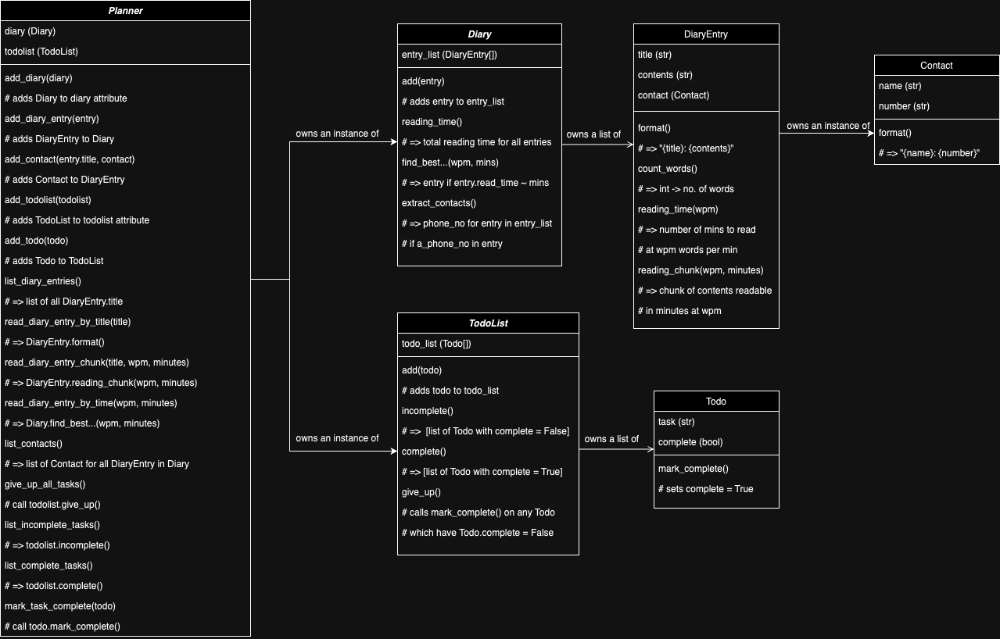

# Diary and Todo List Multi-Class Planned Design Recipe

## 1. Describe the Problem

_Put or write the user story here. Add any clarifying notes you might have._
> As a user  
> So that I can record my experiences  
> I want to keep a regular diary

> As a user  
> So that I can reflect on my experiences  
> I want to read my past diary entries 

> As a user  
> So that I can reflect on my experiences in my busy day  
> I want to select diary entries to read based on how much time I have and my
> reading speed

> As a user  
> So that I can keep track of my tasks  
> I want to keep a todo list along with my diary

> As a user  
> So that I can keep track of my contacts  
> I want to see a list of all of the mobile phone numbers in all my diary
> entries

- User requirements can be separated broadly into:
    - Planner:
        - Diary
            - DiaryEntry
                - Contact
        - Todo List
            - ToDo

- Diary
    - Diary
        - Holds and adds to DiaryEntry list
        - Accesses DiaryEntry instances
        - Gets DiaryEntry instances on demand (by title?)
        - Can autoselect DiaryEntry instance based on reading time
        - Can extract phone numbers from DiaryEntry
    - DiaryEntry
        - Has a title (str) and contents (str)
        - Can return reading time based on wpm
        - Can return Contact attributes
    - Contact
        - Has public attributes name (str) phone number (str)

- TodoList
    - TodoList
        - Holds and adds to list of Todo instances
        - Accesses the Todo instances
        - Can list (in)complete tasks
        - Can mark all tasks as completed
    - Todo
        - Has a task name (str) and a completeness (bool)
        - Has a method for marking the task complete

## 2. Design the Class System

_Consider diagramming out the classes and their relationships. Take care to
focus on the details you see as important, not everything. The diagram below
uses asciiflow.com but you could also use excalidraw.com, draw.io, or miro.com_



_Also design the interface of each class in more detail._

```python
class MusicLibrary:
    # User-facing properties:
    #   tracks: list of instances of Track

    def __init__(self):
        pass # No code here yet

    def add(self, track):
        # Parameters:
        #   track: an instance of Track
        # Side-effects:
        #   Adds the track to the tracks property of the self object
        pass # No code here yet

    def search_by_title(self, keyword):
        # Parameters:
        #   keyword: string
        # Returns:
        #   A list of the Track objects that have titles that include the keyword
        pass # No code here yet


class Track:
    # User-facing properties:
    #   title: string
    #   artist: string

    def __init__(self, title, artist):
        # Parameters:
        #   title: string
        #   artist: string
        # Side-effects:
        #   Sets the title and artist properties
        pass # No code here yet

    def format(self):
        # Returns:
        #   A string of the form "TITLE by ARTIST"
        pass # No code here yet

```

## 3. Create Examples as Integration Tests

_Create examples of the classes being used together in different situations and
combinations that reflect the ways in which the system will be used._  

These examples do not include argument validation, but each method should be checked for 
arguments that are of the wrong data type (raising TypeError).

```python
#
# Planner Integration
#
"""
Given a planner
When we add a diary
We see that diary reflected in a public variable
"""
planner = Planner()
diary = Diary()
planner.add_diary(diary)
planner.diary # => <Diary object>

"""
Given a planner and a diary
When we add a diary entry
We see that diary reflected in the diary's entry list
"""
planner = Planner()
diary = Diary()
planner.add_diary(diary)
entry1 = DiaryEntry("Title 1", "Contents 1")
entry2 = DiaryEntry("Title 2", "Contents 2")
planner.add_diary_entry(entry1)
planner.add_diary_entry(entry2)
planner.list_diary_entries() # => ["Title 1", "Title 2"]

"""
Given a planner, a diary and some diary entries
When we add a contact
We see that contact reflected in the contacts list
"""
planner = Planner()
diary = Diary()
planner.add_diary(diary)
entry1 = DiaryEntry("Title 1", "Contents 1")
entry2 = DiaryEntry("Title 2", "Contents 2")
planner.add_diary_entry(entry1)
planner.add_diary_entry(entry2)
contact1 = Contact("Name 1", "01234567890")
contact2 = Contact("Name 2", "09876543210")
planner.add_contact(entry1, contact1)
planner.list_contacts() # => ["Name 1: 01234567890", "Name 2: 09876543210"]

"""
Given a planner, a diary and some diary entries
Using the read_diary_entry_by_title(entry.title) method
We can return the entry.contents
"""
planner = Planner()
diary = Diary()
planner.add_diary(diary)
entry1 = DiaryEntry("Title 1", "Contents 1")
entry2 = DiaryEntry("Title 2", "Contents 2")
planner.add_diary_entry(entry1)
planner.add_diary_entry(entry2)
planner.read_diary_entry_by_title("Title 1") # => "Contents 1"

"""
Given a planner, a diary and some diary entries
Using the read_diary_entry_chunk(entry.title, wpm, minutes) method
We can return a chunk of entry.contents which can be read in minutes,
at a reading speed of wpm.
(Each chunk starts at the end of the previous until the whole entry has been read,
then resets at the beginning.)
"""
planner = Planner()
diary = Diary()
planner.add_diary(diary)
entry1 = DiaryEntry("Title 1", "This diary entry's contents has seven words.")
entry2 = DiaryEntry("Title 2", "This entry has more words than the previous one. In total, twelve.")
planner.add_diary_entry(entry1)
planner.add_diary_entry(entry2)
planner.read_diary_entry_chunk("Title 1", 4, 1) # => "This diary entry's contents"
planner.read_diary_entry_chunk("Title 1", 4, 1) # => "has seven words."
planner.read_diary_entry_chunk("Title 1", 2, 3) # => "This diary entry's contents has seven"

"""
Given a planner, a diary and some diary entries
Using the read_diary_entry_by_time(wpm, minutes) method
We can return the longest entry whose contents can be read
in less than (or equal to) minutes, with a reading speed of wpm.
"""
planner = Planner()
diary = Diary()
planner.add_diary(diary)
entry1 = DiaryEntry("Title 1", "There are seven words in this contents.")
entry2 = DiaryEntry("Title 2", "There are ten words in the contents of this entry.")
entry3 = DiaryEntry("Title 3", "This entry has five words.")
for entry in [entry1, entry2, entry3]:
    planner.add_diary_entry(entry)
planner.read_diary_entry_by_time(8, 1) # => "There are seven words in this contents."
planner.read_diary_entry_by_time(5, 2) # => "There are ten words in the contents of this entry."

"""
Given a planner
When we add a todolist
We see that todolist reflected in a public variable
"""
planner = Planner()
todolist = TodoList()
planner.add_todolist(todolist)
planner.todolist # => <TodoList object>

"""
Given a planner and a todolist
When we add a todo
We see that todo reflected in the todolist
"""
planner = Planner()
todolist = TodoList()
planner.add_todolist(todolist)
todo = Todo("Task")

"""
Given a planner, a todolist and some todos
Using the give_up_all_tasks() method
We can mark all the todos as complete
"""
planner = Planner()
todolist = TodoList()
planner.add_todolist(todolist)
todo1 = Todo("Task 1")
todo2 = Todo("Task 2")
todo3 = Todo("Task 3")
planner.give_up_all_tasks() # returns None, sets todo.complete = True for all todos
planner.list_complete() # => [<todo1>, <todo2>, <todo3>]

"""
Given a planner, a todolist and some todos
Using the list_incomplete() method
We return a list of all todos that have not been marked complete
"""
planner = Planner()
todolist = TodoList()
planner.add_todolist(todolist)
todo1 = Todo("Task 1")
todo2 = Todo("Task 2")
todo3 = Todo("Task 3")
planner.mark_task_complete(todo2)
planner.list_incomplete() # => [<todo1>, <todo3>]

#
# Diary Integration
#
"""
Given a diary
When we add an entry
We see that entry reflected in the diary's entry list
"""
diary = Diary()
entry1 = DiaryEntry("Title 1", "Contents 1")
entry2 = DiaryEntry("Title 2", "Contents 2")
diary.add(entry1)
diary.add(entry2)
diary.all() # => ["Title 1", "Title 2"]

"""
Given a diary and some entries
Using the count_words() method
We can return the total number of words in the diary (titles and contents)
"""
diary = Diary()
entry1 = DiaryEntry("Title one", "Two words")
entry2 = DiaryEntry("Title two", "Three more words")
diary.add(entry1)
diary.add(entry2)
diary.count_words() # => 9

"""
Given a diary and some entries
Using the reading_time(wpm) method
We can return the total number of minutes required to read all the diary
entries' contents, at a reading speed of wpm
"""
diary = Diary()
entry1 = DiaryEntry("Title one", "Just three words.")
entry2 = DiaryEntry("Title two", "Three more words.")
diary.add(entry1)
diary.add(entry2)
diary.rading_time(3) # => 2

"""
Given a diary and some entries
Using the find_best_entry_for_reading_time(wpm, minutes) method
We can return the DiaryEntry whose reading time (at wpm) is the closest to minutes
without exceeding minutes
"""
diary = Diary()
entry1 = DiaryEntry("Title one", "Two words")
entry2 = DiaryEntry("Title two", "Three more words")
diary.add(entry1)
diary.add(entry2)
diary.find_best_entry_for_reading_time(2,1) # => entry2

"""
Given a diary and some entries (at least one of which contains a contact)
Using the extract_contacts() method
We can return a list of contacts in the diary
"""
diary = Diary()
contact1 = Contact("Name 1", "01111111111")
contact2 = Contact("Name 2", "02222222222")
entry1 = DiaryEntry("Title one", "Two words", contact1)
entry2 = DiaryEntry("Title two", "Three more words")
entry3 = DiaryEntry("Title three", "An additional four words", contact2)
diary.add(entry1)
diary.add(entry2)
diary.add(entry3)
diary.extract_contacts() # => ["Name 1: 01111111111", "Name 2: 02222222222"]

#
# DiaryEntry Integration
#
"""
Given a Contact
When we instantiate a DiaryEntry including the Contact
We see the contact reflected in a public variable
"""
contact = Contact("Name", "01234567890")
entry = DiaryEntry("Title", "Contents", contact)
entry.contact # => contact

"""
Given a DiaryEntry and a Contact
Using the add_contact(Contact) method
We see the contact reflected in the DiaryEntry.contact variable
(This may overwrite a previous contact!)
"""
contact = Contact("Name", "01234567890")
entry = DiaryEntry("Title", "Contents")
entry.add_contact(contact)
entry.contact # => contact

"""
Given a DiaryEntry which contains a Contact
Using the display_contact() method
We can return a formatted string with the name and number of the Contact
"""
contact = Contact("Name", "01234567890")
entry = DiaryEntry("Title", "Contents")
entry.add_contact(contact)
entry.display_contact() # => "Name: 01234567890"

#
# TodoList Integration
#
"""
Given a TodoList and a Todo
When we add a Todo
We see the Todo reflected in a public variable
"""
todolist = TodoList()
todo = Todo("Task")
todolist.add(todo) 
todolist.todo_list # => [todo]

"""
Given a TodoList and some Todos
When some Todos are completed
We can return a list of the (in)complete Todos
"""
todolist = TodoList()
todo1 = Todo("Task 1")
todo2 = Todo("Task 2")
todo3 = Todo("Task 3")
todo4 = Todo("Task 4")
todo1.mark_complete() # => sets todo1.complete = True
todo4.mark_complete() # => sets todo4.complete = True
for todo in [todo1, todo2, todo3, todo4]:
    todolist.add(todo)
todolist.complete() # => [todo1, todo4]
todolist.incomplete() # => [todo2, todo3]

"""
Given a TodoList and some Todos
Using the give_up() method
We can mark all the Todos in the TodoList as complete
"""
todolist = TodoList()
todo1 = Todo("Task 1")
todo2 = Todo("Task 2")
todo3 = Todo("Task 3")
todo4 = Todo("Task 4")
todo1.mark_complete() # => sets todo1.complete = True
todo4.mark_complete() # => sets todo4.complete = True
for todo in [todo1, todo2, todo3, todo4]:
    todolist.add(todo)
todolist.complete() # => [todo1, todo4]
todolist.give_up()
todolist.complete() # => [todo1, todo4, todo2, todo3]
```

## 4. Create Examples as Unit Tests

_Create examples, where appropriate, of the behaviour of each relevant class at
a more granular level of detail._  

These examples do not include argument validation, but each method should be checked for 
arguments that are of the wrong data type (raising TypeError).

```python
#
# Planner Unit Tests
#
"""
When we instantiate Planner
We see two public variables: diary = None and todolist = None
"""
planner = Planner()
planner.diary # => None
planner.todolist # => None

"""
Given a Planner
When we try to add a diary or todolist of the wrong type
A TypeError is raised
"""
planner = Planner()
planner.add_diary(None) # => TypeError: diary must be a Diary object
planner.add_todolist(None) # => TypeError: todolist must be a TodoList object

"""
Given a Planner
When we try to add a diary entry or contact but there is no diary
An Exception is raised
"""
planner = Planner()
entry = DiaryEntry("Title", "Contents")
contact = Contact("Name", "01234567890")
planner.add_diary_entry(entry) # => Exception: Planner has no diary
planner.add_contact(entry, contact) # => Exception: Planner has no diary

"""
Given a Planner
When we try to add a todo but there is no todolist
An Exception is raised
"""
planner = Planner()
todo = Todo("Task")
planner.add_todo(todo) # => Exception: Planner has no to do list

"""
Given an empty Planner
When we try to use methods that require a diary
An Exception is raised
"""
planner = Planner()
wpm = 1
minutes = 1
planner.list_diary_entries() # => Exception: Planner has no diary
planner.read_diary_entry_by_title("Some title") # => Exception: Planner has no diary
planner.read_diary_entry_chunk("Some title", wpm, minutes) # => Exception: Planner has no diary
planner.read_diary_entry_by_time(wpm, minutes) # => Exception: Planner has no diary
planner.list_contacts() # => Exception: Planner has no diary

"""
Given an empty Planner
When we try to use methods that require a todolist
An Exception is raised
"""
planner = Planner()
planner.give_up_all_tasks() # => Exception: Planner has no to do list
planner.list_incomplete_tasks() # => Exception: Planner has no to do list
planner.list_complete_tasks() # => Exception: Planner has no to do list
planner.mark_task_complete() # => Exception: Planner has no to do list

#
# Diary Unit Tests
#
"""
Given an empty diary
When we call methods
We see empty lists or 0 as appropriate
"""
diary = Diary()
wpm = 1
diary.all() # => []
diary.extract_contacts() # => []
diary.count_words() # => 0
diary.reading_time(wpm) # => 0

"""
Given an empty diary
When we try to find the best entry to read in a given time
An Exception is raised
"""
diary = Diary()
wpm = 5
minutes = 1
diary.find_best_entry_for_reading_time(wpm, minutes) # => Exception: Diary is empty!

#
# DiaryEntry Unit Tests
#
"""
When we instantiate a DiaryEntry
We see its title and contents reflected in public variables
"""
entry = DiaryEntry("Title", "Contents")
[entry.title, entry.contents] # => ["Title", "Contents"]

"""
Given a DiaryEntry
When we call count_words()
We return the number of words contained in both the title and contents
"""
entry = DiaryEntry("Three word title", "And a five word contents.")
entry.count_words() # => 8

"""
Given a DiaryEntry
When we call count_reading_time(wpm)
We return the number of minutes required to read the contents at wpm words per minute
"""
entry = DiaryEntry("Title", "This contents section contains six words.")
entry.reading_time(3) # => 2

"""
Given a DiaryEntry
When we make repeated calls of reading_chunk(wpm, minutes)
We return consecutive chunks of the entry contents, looping back to the
start once the whole entry has been read
"""
entry = DiaryEntry("Title", "This contents section contains only seven words.")
entry.reading_chunk(3,1) # => "This contents section"
entry.reading_chunk(1,6) # => "contains only seven words."
entry.reading_chunk(2,2) # => "This contents section contains"

#
# Contact Unit Tests
#
"""
When we instantiate a contact with a name and number
We see the name and number reflected in public variables
"""
contact = Contact("Name", "01234567890")
[contact.name, contact.number] # => ["Name", "01234567890"]

"""
When we instantiate a contact with an empty string as name
A ValueError is raised
"""
contact = Contact("", "01234567890") # => ValueError: Empty string cannot be a name

"""
When we instantiate a contact with a number that does not start in "0"
A ValueError is raised
"""
contact = Contact("Name", "11234567890") # => ValueError: Phone numbers must begin with 0

"""
Given a contact
When we call format()
We return a formatted string which includes name and number
"""
contact = Contact("Name", "01234567890")
contact.format() # => "Name: 01234567890"

#
# TodoList Unit Tests
#
"""
When we instantiate a TodoList
We see an empty list of todos in a public variable
"""
todolist = TodoList()
todolist.todo_list # => []

"""
Given an empty TodoList
When we call methods that return lists of todos
We return empty lists
"""
todolist = TodoList()
todolist.incomplete() # => []
todolist.complete() # => []

"""
Given an empty TodoList
When we call give_up()
An Exception is raised
"""
todolist = TodoList()
todolist.give_up() # => Exception: There are no tasks to give up on!

#
# Todo Unit Tests
#
"""
When we instantiate a Todo with a task
We see that task reflected in a public variable
We also see a public variable telling us that the task is incomplete
"""
todo = Todo("Task")
todo.task # => "Task"
todo.complete # => False

"""
When we instantiate a Todo with an empty string task
A ValueError is raised 
"""
todo = Todo("") # => ValueError: Empty string cannot be a task

"""
Given a Todo
When we call mark_complete()
The public complete variable is set to True
"""
todo = Todo("Task")
todo.complete # => False
todo.mark_complete() # todo.complete = True
todo.complete # => True
```

_Encode each example as a test. You can add to the above list as you go._

## 5. Implement the Behaviour

_After each test you write, follow the test-driving process of red, green,
refactor to implement the behaviour._
