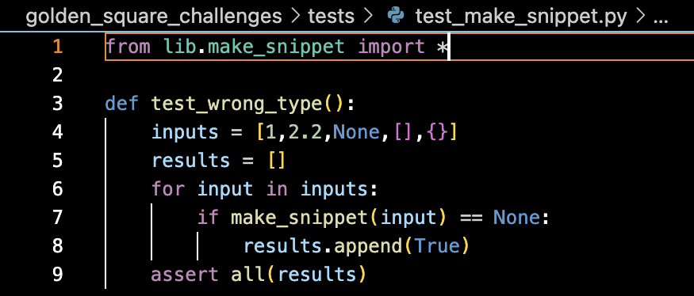
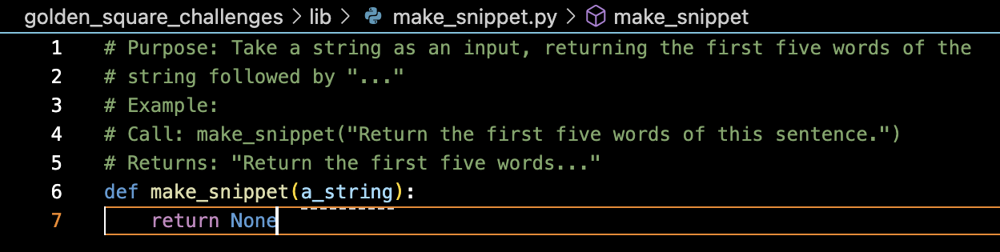
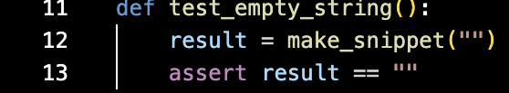
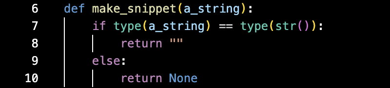
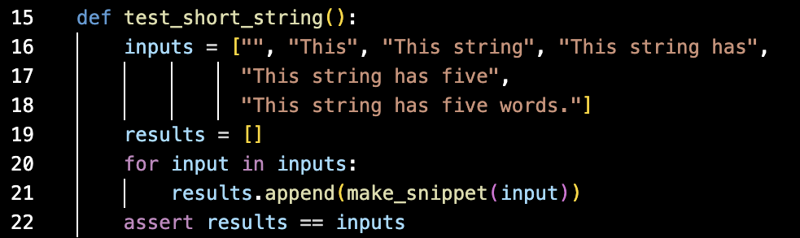
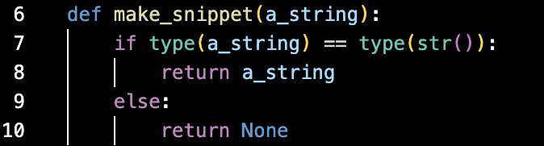
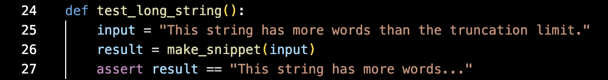
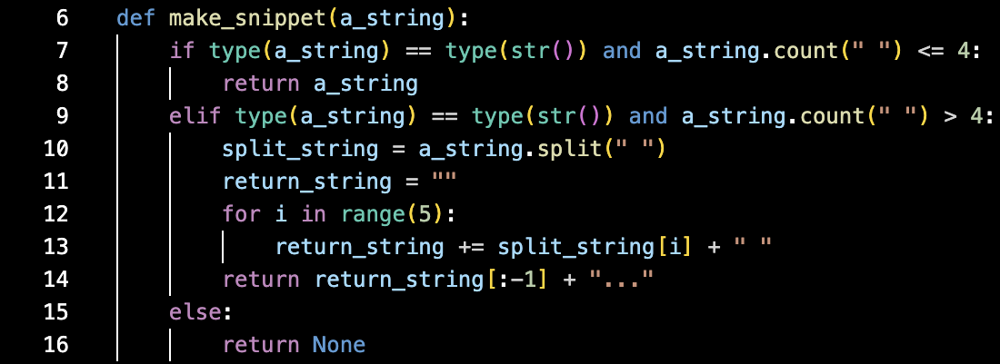

# Process Log
## Breaking Down Requirements
1. The function should take a string as an input.
    - We should check for the input object type.
2. The minimum string input is an empty string.
    - The output should be an empty string.
3. The first function behaviour (returning the full string) should occur for any string of five words or fewer.
    - The output should be the same as the input.
4. The other function behaviour (returning the first five words followed by "...") should occur for any string of six words or more.
    - The output should be the first five words followed by "...".

## Test Driving
1. The function should output nothing if the input is not a string.
    - Write a test (test_wrong_type()) which checks that a None output is given if the input is an integer/float/other non-string: 
    - Run the test: it fails because there is no code in the make_snippet.py file.
    - Write code: 
    - Passes the test!
2. The function should output an empty string when the input is an empty string.
    - Write a test (test_empty_string()) which checks that the output is "" when an empty string is passed to the function: 
    - Run the test: it fails because the function returns None regardless of input.
    - Write code: 
    - Passes the test!
3. When a string with fewer than 6 words is passed to the function, the function returns the input string.  
    - Write a test (test_short_string()) which checks that the input and output are the same when a string with 5 or fewer words is passed to the function: 
    - Run the test: it fails because the function always returns an empty string when the input is a string.
    - Write code: 
    - It passes!
4. When a sentence of 6 or more words in length is passed to the function, it returns a truncated version of the sentence followed by "...".
    - Write a test (test_long_string()) which checks that the output is a string with the first 5 words of the input followed by "...". 
    - Run the test: it fails because the function always returns the input when the input is a string.
    - Write code: 
    - It passes!
5. The code passes all the tests!