# Process Log

## Describe the Problem: User Story
> As a user  
> So that I can manage my time  
> I want to see an estimate of reading time for a text, assuming that I can read
> 200 words a minute.

## Design the Function Signature
1. Name
    - The name should reflect what the function does.
    - It estimates the time it will take to read some text.
    - Let's call it "read_time".
2. Parameters
    - The function needs to work on text, so that text should be an input.
    - The text input will be a string, which we can call "text".
    - The user requires only one reading speed (200 words per minute) to be considered.
    - The reading speed can be declared as a variable within the function, as it will not change.
    - So, there are no other parameters.
3. Returns
    - The function should return the calculated reading time.
    - It should do this in a formatted string, so it is easy to tell how many minutes/seconds it will take.
    - The number of seconds should be rounded to the nearest second as this is an estimate, not an exact prediction.
    - This should meet the user's need in terms of managing time.
4. Side Effects
    - The function will not interact with files or directories.
    - Nothing will be stored or changed permanently.
    - There should be no unwelcome side effects.

## Create Examples as Tests
1.
    a. Call:
    > read_time(123)

    b. Returns:
    > "The input was not text."

2. 
    a. Call:
    > read_time(")  
    
    b. Returns:
    > "Estimated time to read: 0 min 0 sec"

3.
    a. Call:
    > read_time("A simple string of several words.")

    b. Returns:
    > "Estimated time to read: 0 min 2 sec"

4.
    a. Call:
    > read_time(a_much_longer_string_with_420_words)

    b. Returns:
    > "Estimated time to read: 2 min 6 sec"

5.
    a. Call:
    > read_time(a_string_containing_9620_words_from_a_txt_file)

    b: Returns:
    > "Estimated time to read: 48 min 6 sec"

6.
    a. Call:
    > read_time(a_string_with_double_spaces_and_50_words)

    b. Returns:
    > "Estimated time to read: 0 min 15 sec"

## Test-Driving Development
1.
    a. Create test_wrong_type() to check whether the input is a string. 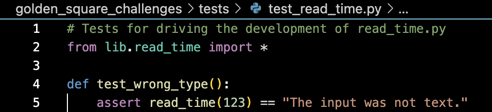
    - Test fails: reason.
    - Write code: 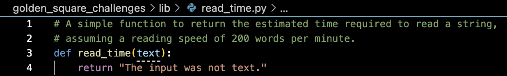
    - Test passes!

    b. Create test_empty_string() to check that the estimated reading time is output in the correct format. 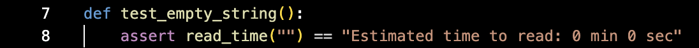
    - Test fails: reason.
    - Write code: 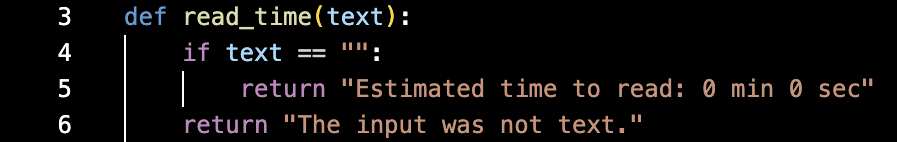
    - Test passes!

    c. Create test_short_string() to check that the estimated reading time is correct and in the expected format. 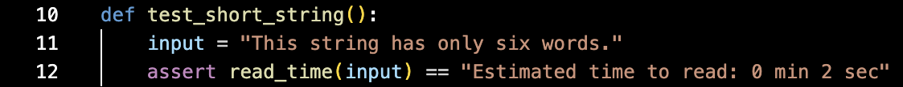
    - Test fails: reason.
    - Write code: 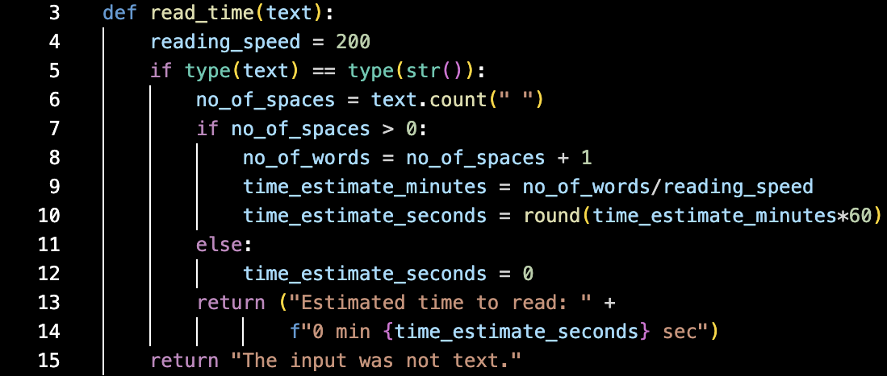
    - Test passes!

    d. Create test_long_string() to check that the estimated reading time is correct and in the expected format, even when the string would take minutes to read. 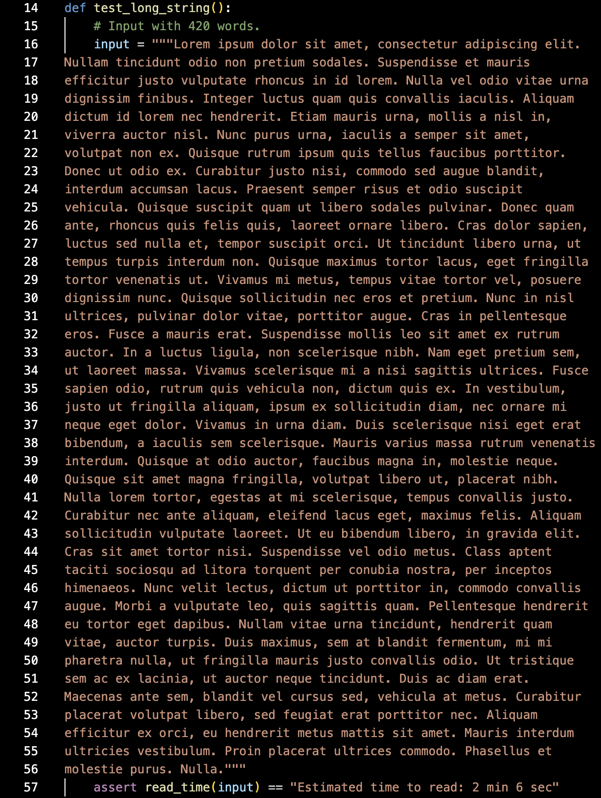
    - Test fails: reason.
    - Write code: 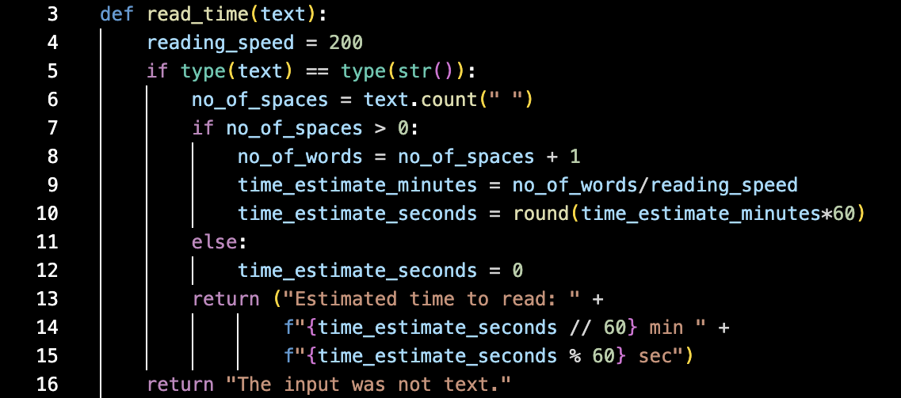
    - Test passes!

    e. Create test_newlines() to check that the estimated reading time is correct and in the expected format, even when the string contains multiple lines. 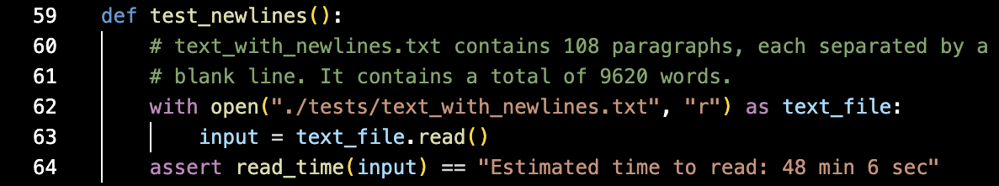
    - Test fails: reason.
    - Write code: 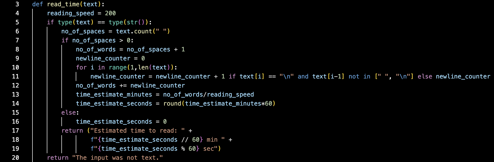
    - Test passes!

    f. Create test_double_spaced() to check that the estimated reading time is correct and in the expected format, even when the string contains whitespaces which do not separate words. 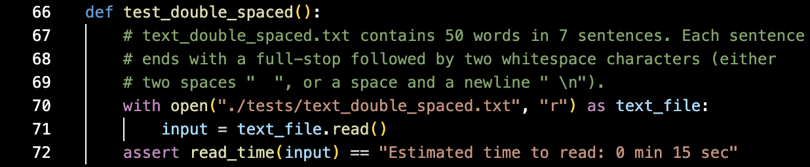
    - Test fails: reason.
    - Write code: 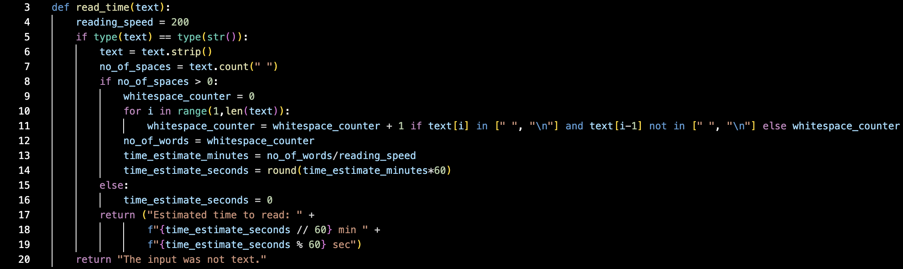
    - Test passes!
