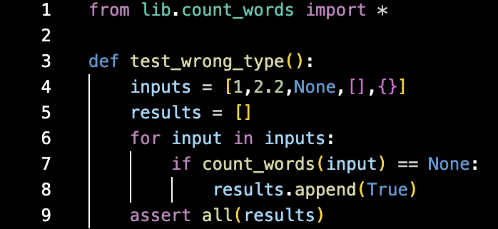
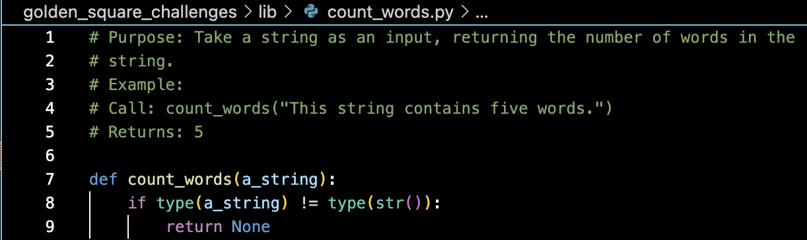
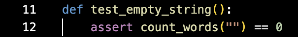
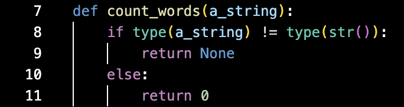
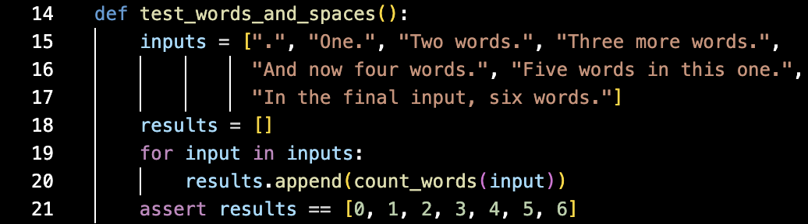
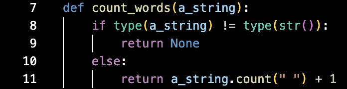
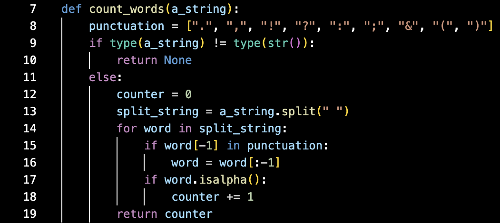
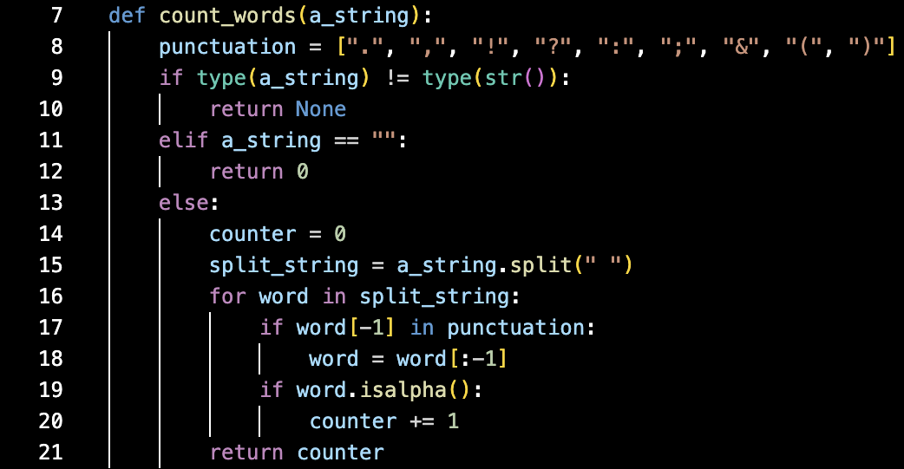
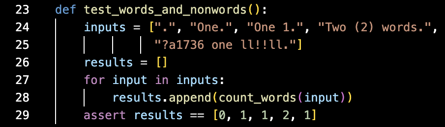

# Process Log
## Breaking Down Requirements
1. The function should take a string as an input.
    - We should check for the input object type.

2. The minimum string input is an empty string.
    - The output should be the integer 0.

3. The function should return the number of words (string parts that are separate).
    - The output should be the number of string sections which are separated by spaces.

4. The function should count only proper words - not numerals or punctuation.
    - The output should be the number of string sections which are separated by spaces and are also solely alphabetic (with the exception of punctuation at the end of a section).

## Test Driving
1. The function should output nothing if the input is not a string.
    - Write a test (test_wrong_type()) which checks that a None output is given if the input is an integer/float/other non-string: 
    - Run the test: it fails because there is no code in the count_words.py file.
    - Write code: 
    - Passes the test!

2. The function should output 0 when the input is an empty string.
    - Write a test (test_empty_string()) which checks that the output is 0 when an empty string is passed to the function: 
    - Run the test: it fails because the function returns None regardless of input.
    - Write code: 
    - Passes the test!

3. When a string with several words is passed to the function, the function returns the number of sections separated by spaces.  
    - Write a test (test_words_and_spaces()) which checks that the correct number of words is counted when there are no numerals in the input: 
    - Run the test: it fails because the function always returns 0 when the input is a string.
    - Write code: 
    - It fails this test and the previous one because the minimum return value is now 1.
    - Rewrite the code: 
    - It passes the new test, but fails the empty string test through IndexError. An empty string has no [-1] index.
    - Rewrite the code again: 
    - It passes!

4. When a string containing words, spaces, punctuation and numerals is passed to the function, the output is the number of alphabetic words only.
    - Write a test (test_words_and_nonwords()) which checks that the output is a count that ignores numerals, nonsense "words" and punctuation. 
    - Run the test: it already passes!

5. The code passes all the tests!

> Note:
> By including punctuation in the test_words_and_spaces() function, the code was forced to accommodate non-alpha characters before the final test. In hindsight, this could have been avoided, and may have been a contributor to the increased difficulty when writing code to pass the third test.